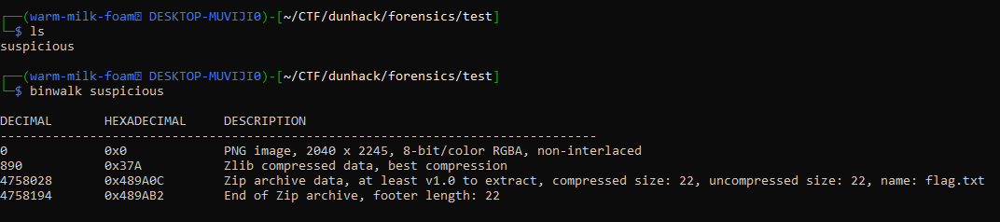
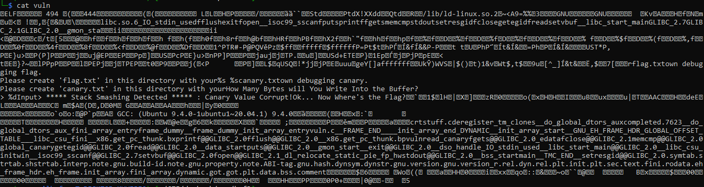
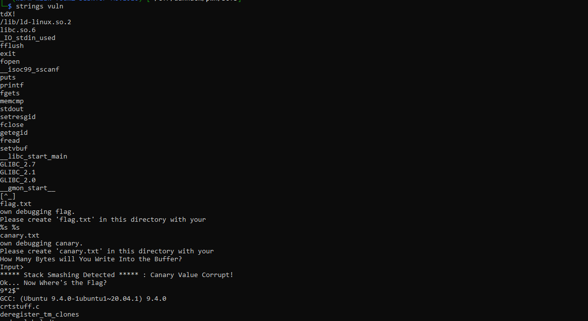

# Chapter 2: The bare essentials #
### A few common bases you would need to know ###
1) Base 2 aka binary: consists of 0s and 1s, where 8 of these (called bits) make up a character
- E.g. 'a' is `0110 0001`, where 0 and 1 are a 'bit'
- One of the ways where information can be hidden

2) Base 10 aka numeric system: 1-10
- Its just the normal way that people count irl
- Just a good thing to know so that you can differentiate them from the other bases
- Text can sometimes appear in this form as in ASCII (American Standard Code for Information Interchange)
- Some text like "Hello" can be displayed as `72 101 108 108 111 10`

3) Base 16 aka hex
- 16 base numbering system (0-9, A-F)
- Basically `A → 10, B → 11, C → 12, D → 13 E →14 F → 15`
- Starts at 0 because computers are 0-indexed (aka first item start at 0)
- ASCII text can aslo rely on hex, where "Hello" can be displayed as `48 65 6C 6C 6F 0A`

4) Base 64
- 64 characters are used to encode stuff
- Can usually be found through the '==' at the back

### How to decode these:
1) Cyberchef - Will identify for you

Credits: <https://github.com/Milo-sipper/forensics-101/blob/master/Basics/1.2%20Hex%20editing%2C%20Binary%2C%20decimal%2C%20and%20base%2064.md>

--- 

## Some basic CLI tools that you must know
I find that these tools are very important in the world of forensics. These tools are able to give you a high-level analysis of the file you are given, which will tell you what tool you should use.
## 1)  file ##
- All this does is tell you the file type of the challenge you are given
- This is REALLY useful because: 
    It will tell you the actual file type (challenge could have a decoy file extension)
    It tells you what tools can be used for analysis
- This comes pre-installed in a linux distro
## 2)  Exiftool ## 
- Gives you metadata of the file (metadata - data about other data)   
       
- Especially useful in giving you hidden comments, authors, and other information which can lead to a flag
- To install  
`sudo apt update` -> Updates your system to latest version (Good practice)   
`sudo apt install libimage-exiftool-perl` -> Installs exiftool
## 3)  Binwalk ##
- Identify and also extract information embedded within files

- To install  
`sudo apt update`  
`sudo apt install binwalk` -> Install binwalk    
## 4) cat & strings ##
- They come preinstalled with (I think) every linux distro system
- `cat` will print out the whole contents of the file (meaning that some weird unreadable gunk will most likely pop up) 
- `strings` will print out all ASCII readable strings in a file 
- Here is the difference...  
   
   
- Most of the time, 'cat' might overwhelm your terminal, so the commands `head` and `tail` might be better (print a small section of the start and end respectively)
- If you are lucky, these basic commands will reveal the flag to you if they are not encoded

These tools are very important to having a high level analysis of whatever file you are inspecting   
   
      
         
            
*also today I figured out that computer names don't actually pose a privacy risk*