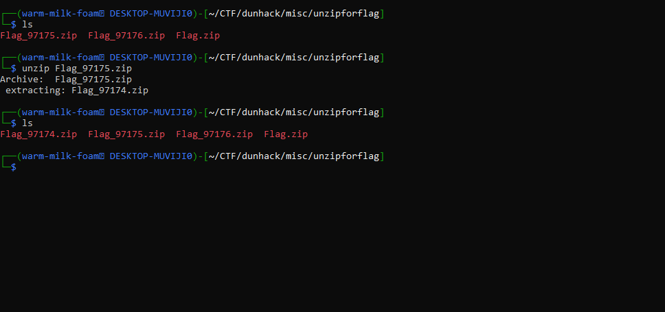

#  Chapter5: Zip archives  #
Usually, people would open zip files in real life by having software such as `WinRAR`. `7zip`, etc.    
However, CTF challenges would use special gimmicks of zip files which normal software won't be able to help much with. I will try to explain to you .  
And as mentioned before, here are some of the tools this chapter will run through:   

- `7z` tool (Can unzip many file formats)
- `unzip` tool (the standard which should always be present)
- `tar` tool (extract from .tar files)
- `unrar` tool (extract from .rar files)
- `zipinfo OR 7z l` (Information about zip encryption. Yes that matters)
- `fcrackzip` (Bruteforce specifically for zip files)
- **`john + zip2john`** (Bruteforce for many kinds of files) w
- `bkcrack` (Plaintext attack for zipped files)
- `hashcat` (Bruteforce password hash when you extract it with `john`)
- `rockyou.txt` (Your standard password dictionary containing just about every common password)   

For john, there is a 'jumbo' version which is enhanced by the community with **\support for more hashes and ciphers**  

There are two kinds of attacks you would need to know:  
1) Bruteforce - Guess the password by sending different characters and lengths
2) Dictionary - Send passwords from a dictionary (like `rockyou.txt`) in hopes that the password is commonly used 
   
## 1) Password-encrypted zip files
- Most of the time you zip files in forensics are encrypted with a password
- These zip files are encrypted in different ways, so different cracking software should be used against each one
- Here are some tools to deal with such challenges   
### 1) fcrackzip
- Good for zip files that have weak encryption (Not AES encrypted, which you can tell with `zipinfo`)
- It can be very easily installed with `sudo apt install fcrackzip`
- Command to run it:   
`fcrackzip -v -u -D -p rockyou.txt -z secret.zip` where rockyou.txt is a dictionary
`-v` means verbose, where the attack progress is shown  
`-u` tests the first file, making the attack faster  
`-D -p` means a dictionary attack and supplies a password list  

### 2) john & hashcat
- Work better for AES-encrypted zips than `fcrackzip` by extrracting a hash to break    
- Use `zip2john challenge.zip > zip.hash` to extract the hash  
- `john zip.hash --wordlist=rockyou.txt` to attempt dictionary attack 
- `hashcat -m 13600 zip.hash rockyou.txt` as another alternative  
- `hashcat` can handle many hash varieties and is faster than john
- Both are better for modern encryptions
- You can see what hashes that `hashcat` can break here: https://hashcat.net/wiki/doku.php?id=hashcat   
- A guide to using john
### 3) BKcrack
- Uses known plaintext attacks to attack a ZipCrypto-encrypted file
- Can be installed with:  
`sudo apt install bkcrack`  
OR manually with:  
`git clone https://github.com/kimci86/bkcrack.git`  
`cd bkcrack`  
`make`  
- For example, if you know that inside the challenge zip file there is a string (like "flag{")  
- You can run:  
`bkcrack -C [path_to_zip_file] -c [encrypted file inside the zip you are targetting] -p [known plaintext]`
- This attempts to recover the internal ZipCrypto keys with a known plaintext attack
- For more info: https://vulners.com/kitploit/KITPLOIT:1672845780085945004  

also this is where i learnt about bkcrack https://github.com/NUSGreyhats/greyctf25-challs-public/tree/main/forensics/notsus.exe/sol

## 2) Zip archives that are obscenely big 
A staple in CTFs, where zip archives are zipped thousands of times, so much so where unzipping it manually will suck big time   
An example would be this one: https://github.com/Coding-Competition-Team/HACK-AC-2021/tree/main/Easy/Misc/Unzip%20for%20flag  
(Yes I am from ACSI how else would I know)  
  

However, this is easy if you know how to script an unzipper  
For the challenge above, I scripted this:
```
for i in range(97175, 0, -1):
  with ZipFile(f"/home/warm-milk-foam/CTF/dunhack/misc/unzipforflag/Flag_{i}.zip", 'r') as zObject:
    zObject.extractall(
        path="/home/warm-milk-foam/CTF/dunhack/misc/unzipforflag")
    print(f"Decrypted {i}")
```
To get the flag