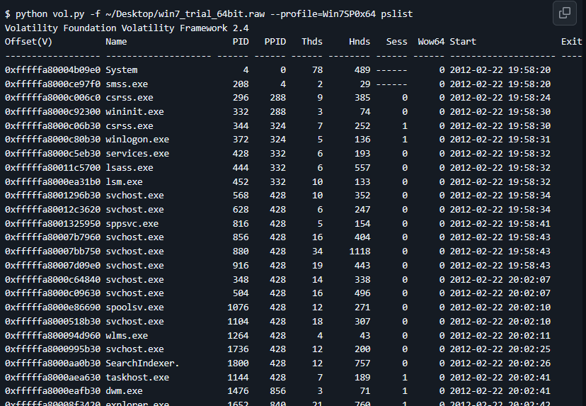

#  Chapter5: Volatility   #
The files are very big because they are memory dumps  
Memory dumps are basically all the information in the RAM of a system at a current point of time    
This is useful when a system crashes, because it tells you what could have went wrong   
In CTFs, the flag would be hidden in one of the processes occurring  

## How do I install?

Let us assume that you have `python2` and `python3` installed  

-To install `Volatility 2` follow these steps:  
```
git clone https://github.com/volatilityfoundation/volatility.git

cd volatility

python2 setup.py install
```
- Which I took from https://mahim-firoj.medium.com/how-to-install-volatility-2-and-how-to-use-it-8d7335e2c26c
- Alternatively, you could also use the executable version, which bypasses the need for you to invoke `python2` for use

Thats usually it, but...  
You may see something like this  

  
This just means volatility is complaining about some things that it requires to do some analysis properly.  
To fix this, you  can run
```
sudo python2 get-pip.py # Install pip2
sudo apt install python2-dev  # So that the next function can run
pip2 install pycryptodome distorm3    # Install your stuff

Note: this may not be something you encounter. Just putting it here because it happened to me. 
```


-To install `Volatility 3` follow these steps:
```
git clone https://github.com/volatilityfoundation/volatility3.git

cd volatility3/

pip3 install -r requirements.txt

# Also, its good practice to download the volatility 3 symbols if they do not show up  

volatility3/volatility3/symbols/  
git clone https://github.com/volatilityfoundation/volatility3-symbols.git  

```  
You may be asking, why do I have to install 2 volatility versions?   
`Volatility 2` - Has large plugin support for older systems  
`Volatility 3` - Modern and has ongoing development for it  
Personally, I like to use volatility 2 for CTF challenges more   

## How do I use? 
Let us assume that you never touched the executable one, meaning that the commands I state here will invoke `python`
Plus, vol2 and vol3 use different commands but here I will just talk about vol2  
Make sure you are in the directory with the `vol.py` file  

1) `python2 vol.py imageinfo -f [your_memory_dump]`
   
- Tells you the suggested profile that you should pass as the parameter to `--profile=PROFILE` when you want further analysis  
- There is also `kdbgscan` and `kprscan` which help to scan the exact profile you should use  

2) `python2 vol.py -f [your_memory_dump] --profile [profile] pslist`
- To sum it up, shows you all running processes 
- Shows you process IDs and their start times  
- `pstree` does this but in a tree form
  
Something like this would show up  
3) 


https://mahim-firoj.medium.com/how-to-install-volatility-2-and-how-to-use-it-8d7335e2c26c   
https://andreafortuna.org/2018/03/02/volatility-tips-extract-text-typed-in-a-notepad-window-from-a-windows-memory-dump/  
https://www.golinuxcloud.com/analyzing-volatility-memory-dump/#Step_2_Checking_the_running_processes     
https://github.com/volatilityfoundation/volatility/wiki/command-reference  
For practice, try the CCT_teaching challenges on dunhack.me (open only to ACSI students)  