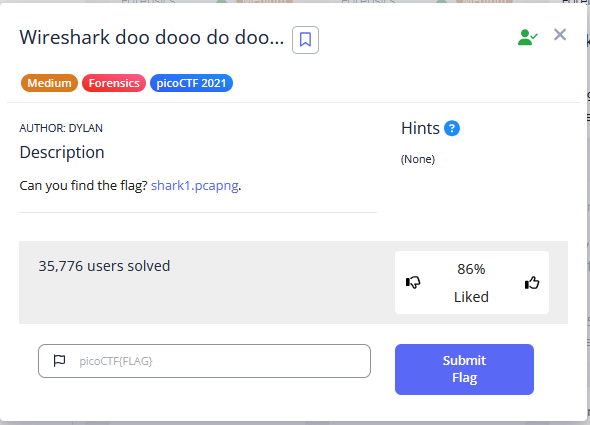

#  Chapter7: Wireshark #
A staple of forensics challenges is network challenges  
So you would often see a .pcap challenge - its automatically Wireshark as your main investigation tool      
Depending on how cheeky the challenge creators want to be, it can be from:
- Just find the string and win
- Advanced problems, like WPA key cracking, DNS tunneling, any networking related issue that requires actual knowledge in the area
   
In this lesson I hope to teach you about:
1) Network packets, the different types and what you should look out for
2) Important functionalities of wireshark that proves useful
3) Some advanced networking methods which I learn while typing these notes

## Installing wireshark!! 
- Install wireshark from https://www.wireshark.org/download.html depending on whether you are on Windows, Mac, etc
- There is a command line version called `tshark` though I won't delve into that

## Some boring theory... 
Ok but you need to know this in order to understand wireshark  

Here is the guideline to how networking works:
- Information is sent between computers through `packets`, which are smaller segments of data
- These packets are encrypted and sent over from a `source` to a `destination`, as you will see in wireshark. The `source` and `destination` are unique IP addresses
- 1) TCP, UDP, HTTP, FTP packets
- Usually, these give you the information being transmitted from the source to destination
- These packets will give you a high level overview on what may be going on

- 2) DNS packets
- Stands for Domain Name System
- Tells you the domain names that is being resolved

- 3) TLS/SSL Packets (Encrypted Traffic)
- Encrypted traffic packets
- More often than not cannot be read in wireshark unless decrypted, but still useful for overview analysis

- 4) ARP packets
- Maps IP addresses to MAC addresses

## What to do from here...
To guide you along, I'm going to be using the challenge file from the picoCTF challenge `Wireshark doo dooo do doo...`  
  
To open it in wireshark, go to `File` > `Open` and select it from your computer   
One of the basic skills is to read the contents of each packet  

References:  
https://www.cloudflare.com/en-gb/learning/network-layer/how-does-the-internet-work/  
https://www.wireshark.org/docs/wsug_html_chunked/ which is a very good read   