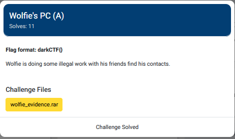
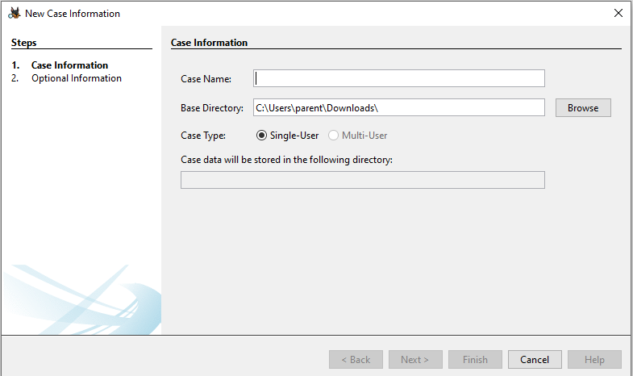
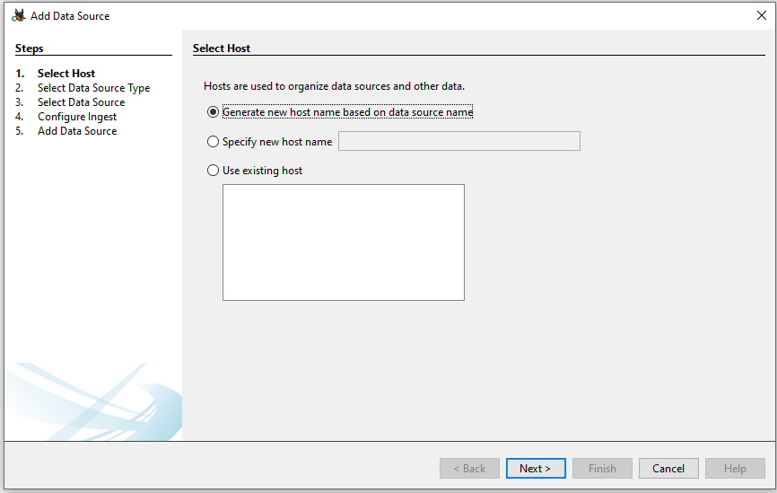
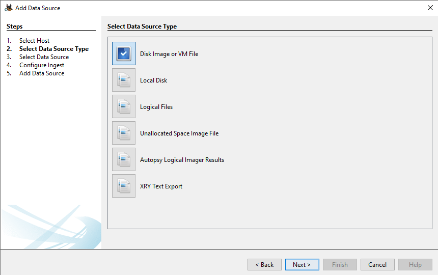
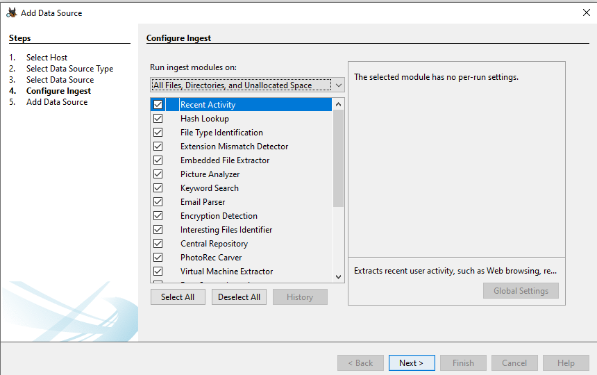

# Chapter 10: Disk imagery #  
A disk image is basically a snapshot of another device's content, and can be recognised by their distinctive `.img` file  
So, you need tools to analyse the filesystem, where a flag is usually hidden within  
There are two tools I like to use for these, namely, `FTKImager` and `Autopsy`, Autopsy has more extensive data analysis, while FTK imager is extremely fast compared to Autopsy

## Starting up Autopsy ##

You can very easily install Autopsy right here https://www.autopsy.com/download/, but the app is quite big so do spend some time to install it properly  

I will be using a file from this challenge, to showcase the functionality of Autopsy:  
  

On opening Autopsy, you will be introduced to this screen:  
   
Just quickly create your case and this will pop up:  
   
Then select your new file type, usually it would be the first option (Disk image):  
   
Put in your file to analyse and this will show up:  
  
This just basically tells you what analysis Autopsy will conduct on your files, and depending on what you want, maybe you could turn on certain modules, but we will not touch on that for now.  

Do note that Autopsy takes a long time to boot up, so be patient using it  

And finally, when our screen loads, you will be greeted to this screen:  

You can click through the files and folders to navigate through the filesystem, just like as you could do with File Explorer on windows (or any other file system you use on your machine)
