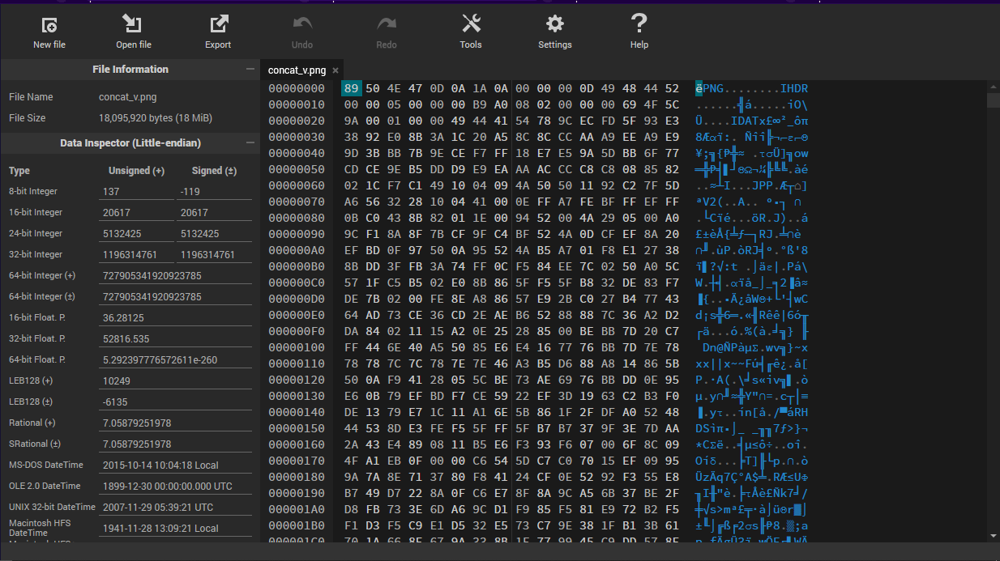
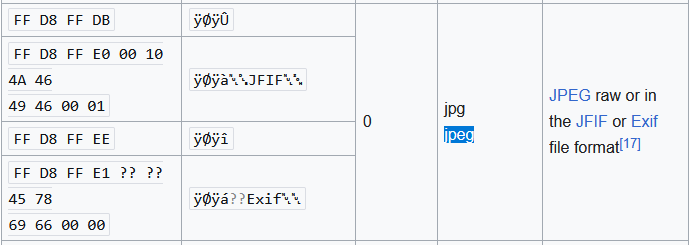

#  Chapter3: Image analysis #
Often, you will be given an image to analyse for a flag. What can you do?   
4 types of files would go under this category: PNGs, JPEGs, GIFs (just basically multiple pictures) and BMPs (Bitmaps)

## Magic bytes ##
- You would know that these is the case when the image does not open properly
- Magic bytes are basically bytes of a file that will tell you what kind of file it is
- To see magic bytes, you can use a online tool called [hexed.it](https://hexed.it/) or you can do in the terminal with multiple hex editor tools that exist out there  
  
As you can see, one of the 2 character chunks is a byte (represented in hex format) such as the highlighted '89'  

But sometimes, these files are 'broken' because the magic bytes are completely wrong

- ### PNG files have:  ###    
1) 8 byte file header `89 50 4E 47 0D 0A 1A 0A` -> Tells the computer it is a PNG file
2) IHDR (Image Header chunk) -> Gives size and other metadata of the PNG
3) IDAT (Image data chunk) -> Multiple of these are found throughout the PNG; they contain the actual image data which is to be displayed
4) IEND (Image End chunk) -> Marks the end of the PNG data; the chunk's data field should be empty

https://www.nayuki.io/page/png-file-chunk-inspector  
^ Using this link, you can find details about the chunks of your image

There is also extra information [here](http://www.libpng.org/pub/png/spec/1.2/PNG-Chunks.html), if you want to learn more

- ### JPEG files are like the same, but they only have one extremely long data chunk ###    
  
They can have different header signatures too

- ### Bitmap images also follow the PNG's chunk like structure, with...  ###
1) Bitmap file header, or the magic bytes -> 14 bytes in total, can be recognised with "BM"
2) DIB Header (Bitmap Information Header) -> Can vary
- Conatins important parts such as width and height of image in pixels -> each 4 bytes
- Colour Plane: 2 bytes
3) Colour Pallete (Optional)
4) Pixel array (aka actual image data)

## If the image renders ##
Then there are three other ways:
1) The flag is hidden inside the image in a file
2) The flag is hidden in plain sight
3) Other advanced techniques (which will go into stego)  

Usually from here, you could continue using the `exiftool` and `aperisolve` tools on a rendered image to see if it produces any viable result.    

If the flag is hidden in a embedded file, there are many ways to approach this problem  
1) Using file carvers such as binwalk and foremost
2) Cyberchef/Aperisolve to try extracting the files  
After which, just rinse and repeat the high level analysis and go lower until you hit the flag

However, if the flag could be hidden in plain slight:  
https://29a.ch/photo-forensics/#forensic-magnifier  
^ This tool will allow you to check for hidden messages, by playing around with the luminous intensity, etc 

Here is some practice:
1) picoctf basic forensics challenges: Glory of the Garden, information, tunnel vision challenges