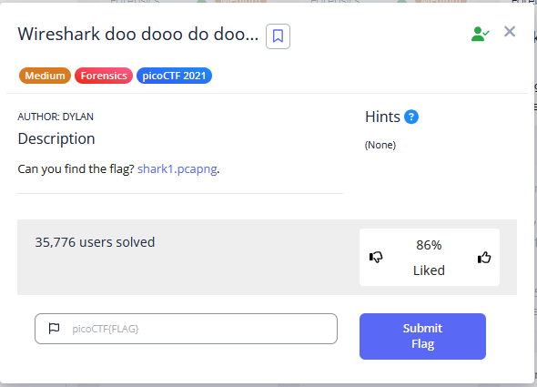
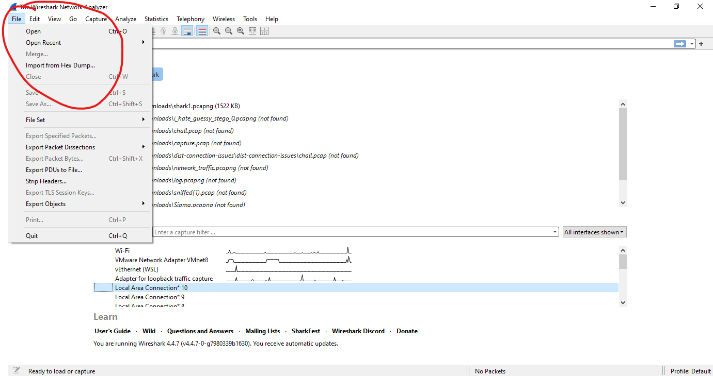
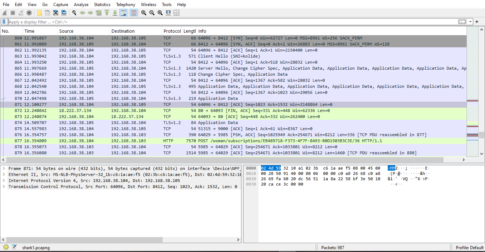
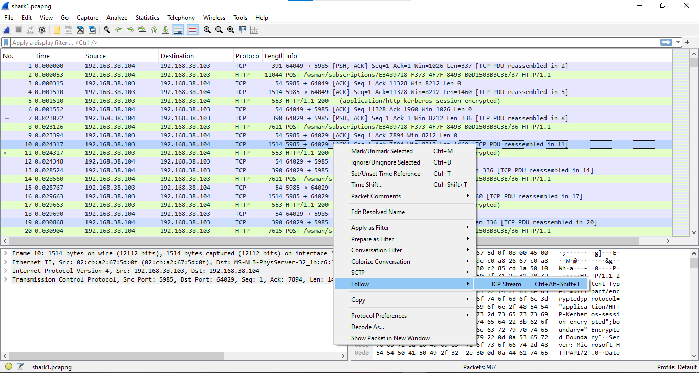
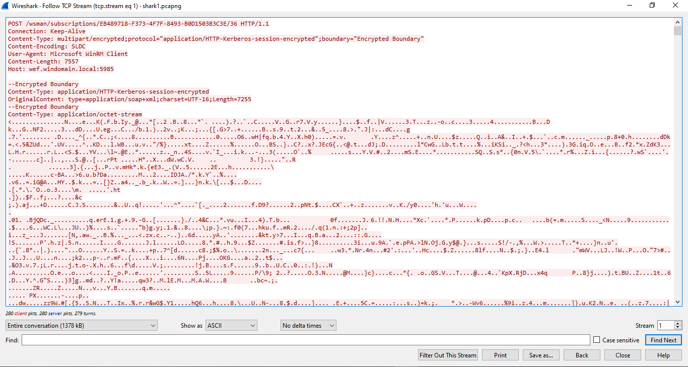
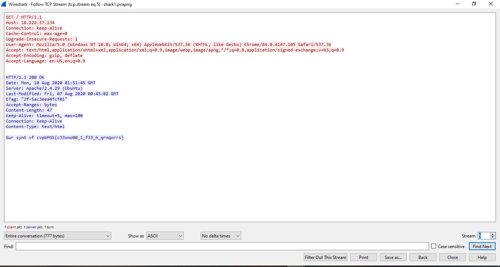
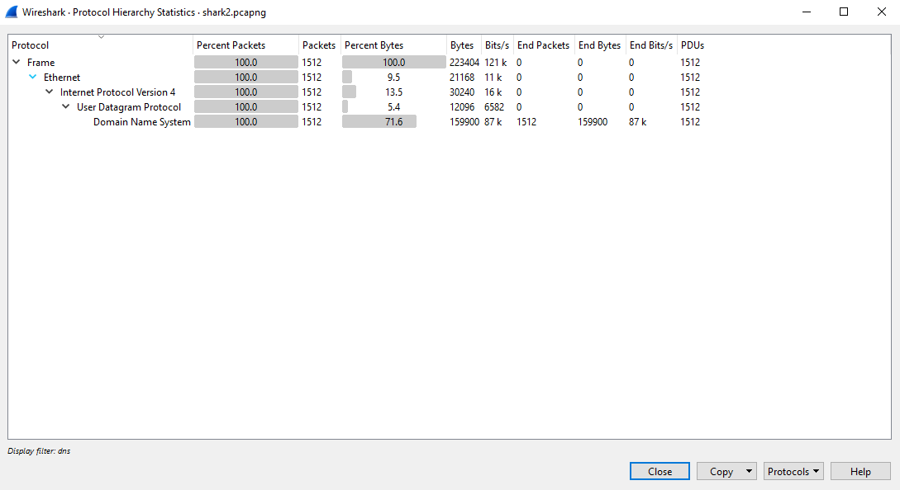

#  Chapter7: Wireshark #
A staple of forensics challenges is network challenges  
So you would often see a .pcap challenge - its automatically Wireshark as your main investigation tool      
Depending on how cheeky the challenge creators want to be, it can be from:
- Just find the string and win
- Advanced problems, like WPA key cracking, DNS tunneling, any networking related issue that requires actual knowledge in the area
   
In this lesson I hope to teach you about:
1) Network packets, the different types and what you should look out for
2) Important functionalities of wireshark that proves useful

This small guide doesn't show you how to use it to capture new network traffic on the spot, but rather for use in CTFs  

## Installing wireshark!! 
- Install wireshark from https://www.wireshark.org/download.html depending on whether you are on Windows, Mac, etc
- There is a command line version called `tshark` though I won't delve into that

## Some boring theory... 
Ok but you need to know this in order to understand wireshark  

Here is the guideline to how networking works:
- Information is sent between computers through `packets`, which are smaller segments of data
- These packets are encrypted and sent over from a `source` to a `destination`, as you will see in wireshark. The `source` and `destination` are unique IP addresses  

1) TCP, UDP, HTTP, FTP packets  
Usually, these give you the information being transmitted from the source to destination  
These packets will give you a high level overview on what may be going on  

2) DNS packets  
Stands for Domain Name System  
Tells you the domain names that is being resolved

3) TLS/SSL Packets (Encrypted Traffic)  
Encrypted traffic packets  
More often than not cannot be read in wireshark unless decrypted, but still useful for overview analysis

4) ARP packets  
Maps IP addresses to MAC addresses  

Essentially, what wireshark aims to do is to break down the network transmission into the packets so it can be analysed easily for users, by giving as much detail as possible about the packets  

## What to do from here...
To guide you along, I'm going to be using the challenge file from the picoCTF challenge `Wireshark doo dooo do doo...`  
  
To open it in wireshark, go to `File` > `Open` and select it from your computer     
One of the basic skills is to read the contents of each packet  

    
Here, we can see the interface of wireshark. There are many things here, but we will focus on a few things now:  
1) The centre shows the list of packets during the network transmission, each having their own unique properties and data.    
2) In the bottom left corner, we will see more data about the protocols and the protocol fields (which isn't too useful to the beginner now, but can suggest anomalous activity)  
3) The most important part of searching is in the bottom right corner, which shows the data of the packet in a hexdump format    

But to get the better read on the packets, you can right-click them and press follow on a stream they are on, so that you can get something like this:    
  
Resulting in a text editor format of all the data in the packet, in ASCII format:  

By changing the streams in the bottom right, you can "walk through" the packets until we come across this:  

This flag is the casear cipher encoded, as can be seen from the last string. 

So, now you know how to use wireshark to read through the packets and its data!  
In CTF challenges, it will definitely become more complicated than this, as they require you to understand what is happening in the network transmission, such as any attacks (DNS tunneling, etc)  

## More functions and features to know about Wireshark
These are just the functions that I as a CTF player often use a lot:  

1) Export Objects  
- Files are often transmitted in network transmissions, so this is often a clue/item needed to solve the challenge and get the flag  
- If you notice a file name in the packets or anything big being transmitted, this could indicate a file object
- You can do this by going into `Files > Export Objects > [Mode in which the file is being transmitted]`

2) Filters
- If you know which packets are of significance to you, you can use the filter function to filter for specific packets
- For example, you can type `tcp` to filter for the specific protocols, use `any ip.addr == [ip address here]` to filter for any specific ip addresses
- More information can be found here: https://www.wireshark.org/docs/man-pages/wireshark-filter.html

3) Protocol Hierachy

- Gives you a brief overview of what packets may be of concern to you  

## Summary  
To summarise, you have learnt:
1) How to quickly look through the packets of data  
2) Different packets and their properties  

Usually, using wireshark in more complicated CTF challenges relies on you looking out for anomalies in the tranmission, based on context and past experience. Of course, I cannot teach anything more advanced than this, but I hope this serves as a complete, fresh start to how Wireshark can be used.  

References:  
https://www.cloudflare.com/en-gb/learning/network-layer/how-does-the-internet-work/  
https://www.wireshark.org/docs/wsug_html_chunked/ which is a very good read   