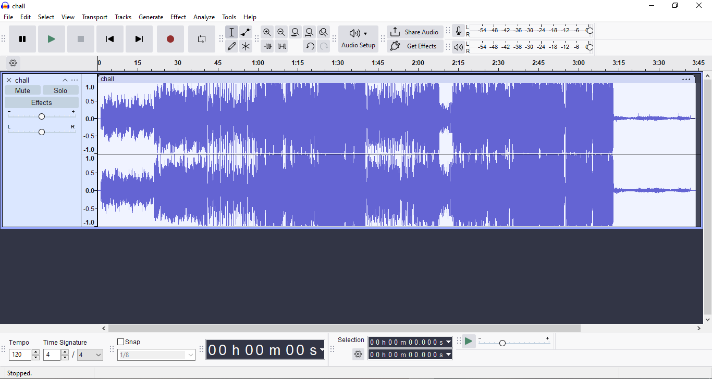
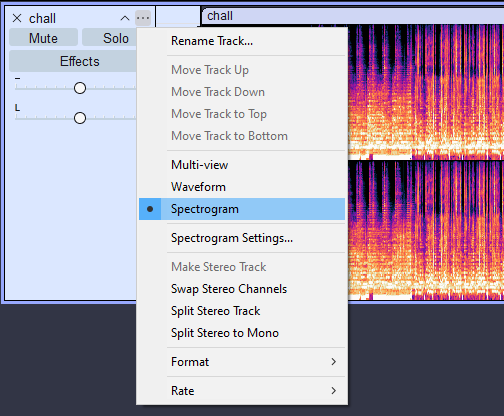
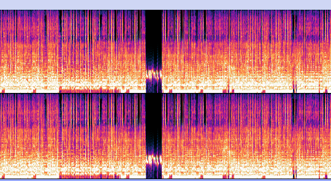
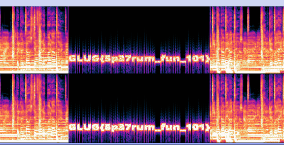
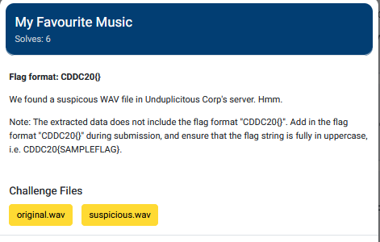
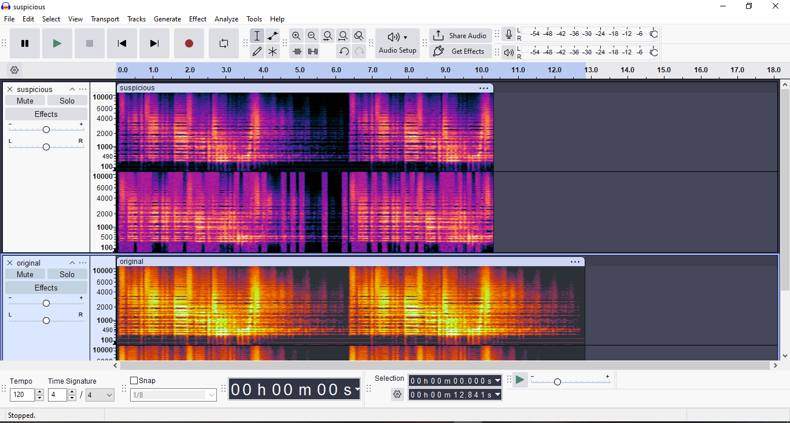
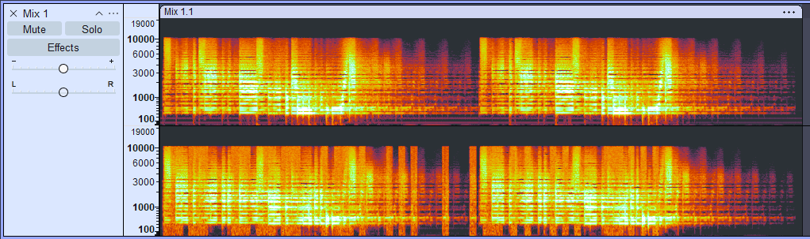
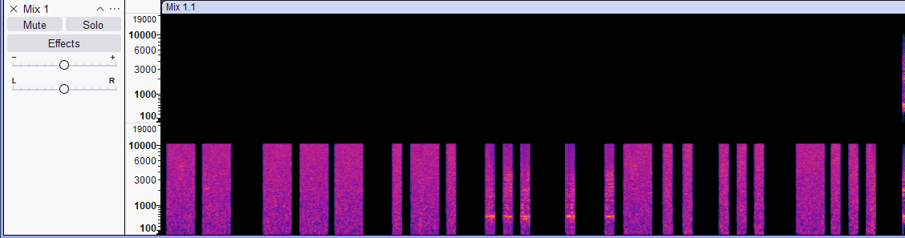

# Chapter8: Audio file analysis #  
Sometimes, files can also be hidden in audio files  
This means that there are two methods the flags can be hidden:  
1) Files/Data can be extracted and read with `exiftool`, `binwalk`  
2) The flag is hidden making use of the audio file medium  

If its 2, usually it would be a tool called `Audacity` and walk through a few challenges showcasing some properties of the tool    

## Spectrogram and waveform ##  

For the first challenge, I will analyse a challenge file `chall.wav` from Render Foobar CTF 2021
(I cannot upload the file because github would complain about the size, and I realised now why my commit wasn't working because it doesn't allow )

  
Here, I opened up `chall.wav` in Audacity, showing us a waveform version of the audio that is stored  
A waveform version refers to the time-domain representation of the sound played, where the y-axis refers to amplitude and the x-axis to the corresponding time  
However, there is nothing of note here, so we would have to change to spectrogram view by clicking the three dots and selecting, `Spectrogram view`    

  

And here, we find something interesting:   
  
And by zooming in, we can see the flag:  

Sometimes, the flag can be hidden through the waveform representation as well, through rhythmic pauses (binary encoding, morse code, etc), but ultimately depends on the context to find anomalies in how the file is presented to you  

## Mixing the files together ##  

Sometimes, flags can only be revealed by mixing the files together in audacity
To showcase this ability, another challenge I will go through will be My Favourite Music from CDDC20  

  

First we started off by placing the two files together.   
  

They both appear to have the same patterns, but the suspicious.wav is significantly shorter.  
At first, I just tried mixing both together, by going to tracks and `Mix and render` after selecting the two tracks, but it yielded this:  

Which was strange, but I noticed that there are just small differences between the both, but there are still the same pattern  

So I inverted the suspicious.wav by going to `Effect > Special > Invert`  
And by mixing both of them, we get this:
  

This appears to be a morse code, with the message:  
`-- --- .-. ... . .-.. ... -...`  
I shoved this into chatgpt and the message is `MORSELSB`

While this is a nice challenge to showcase the significance of mixing and other features audacity has, this challenge is INCREDIBLY guessy, I had to follow a writeup for this

## Summary ##
There are so many techniques and features about Audacity that I still couldn't cover, but I hope this serves as a quickstart guide.  
Do note that audio files can still be subject to analysis with `exiftool` and file carving tools, make sure to always conduct them to search for hidden files and everything  

https://github.com/kinzhong/cddc2020-write-up/blob/master/My%20Favourite%20Music.txt
https://sumit-arora.medium.com/audio-steganography-the-art-of-hiding-secrets-within-earshot-part-2-of-2-c76b1be719b3
