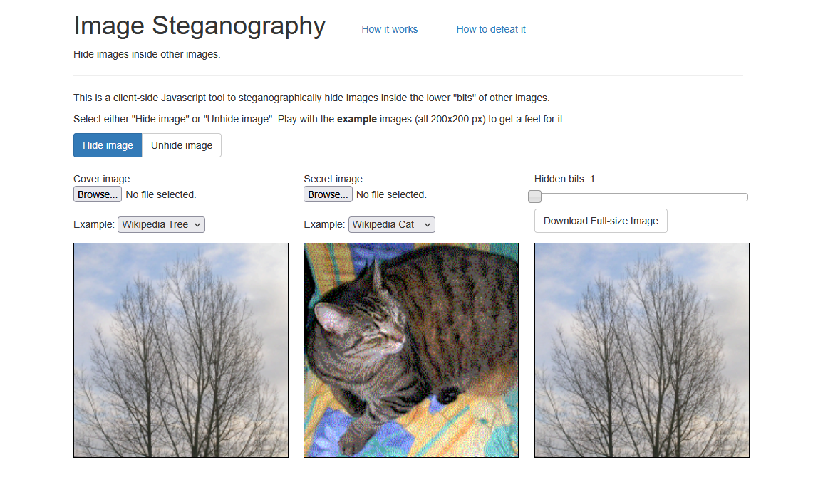
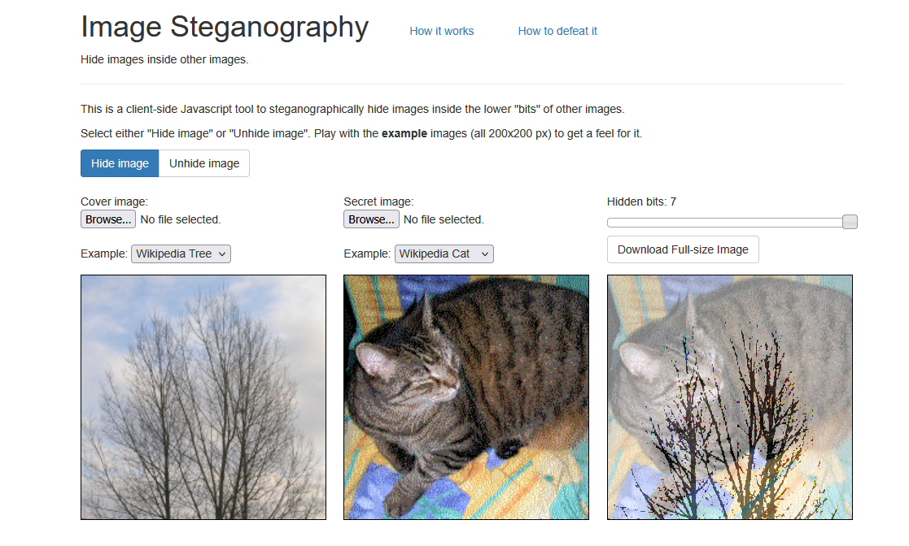
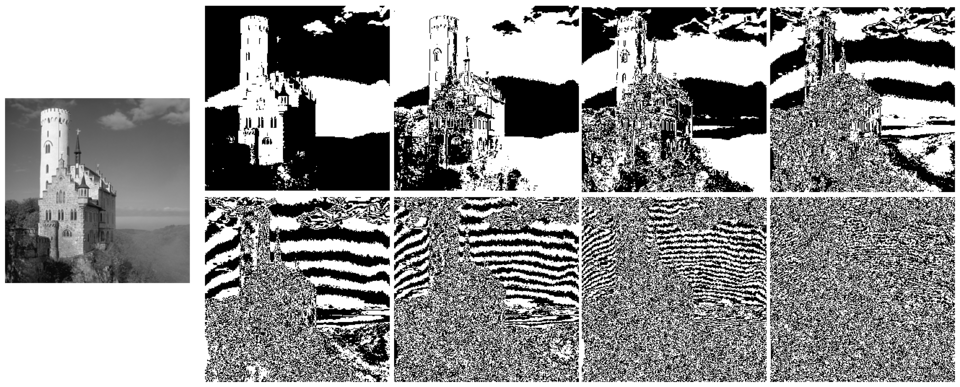
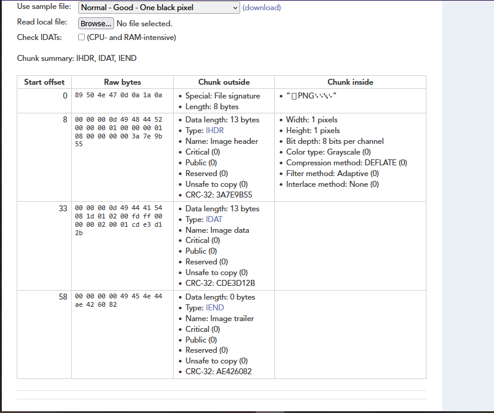

# Chapter9: Steganography (Specific to images) #      
Steganography, as wikipedia defines it, is the concealment of information inside  an image  
So, this section is aimed at   
## LSB ##
As you know, data is stored in bits, such as `01110 0100`   
This technique involves changing the Least Significant Bit, which is the rightmost bit of a byte  so in the earlier example, the rightmost bit is `0`  
For this, lets take a look at this website:  https://incoherency.co.uk/image-steganography/#  
So, for example, lets say I wanted to hide an image of a cat in an image of a tree:  
  
As you can see, the cat image is hidden in the cover image, and you cannot notice it at all even if i told you.  
That is because the data of the cat image is hidden in the LSB of the tree image, which contributes very little to the RGB of the pixels in the overall image    
Honestly, this is not the full story of how it works, but this medium article explains it in more depth: https://medium.com/@renantkn/lsb-steganography-hiding-a-message-in-the-pixels-of-an-image-4722a8567046  
https://www.geeksforgeeks.org/python/image-based-steganography-using-python/ (and this too i guess)  

However, as you hide the data in more significant bits (closer to the left of the bit 'chain'), the RGB values are changed more drastically, leading you to see the image clearer:  
    

To extract the LSB data, you would usually use an online tool such as https://georgeom.net/StegOnline/upload or you can write your own script to extract it yourself  
```
from PIL import Image

def genData(data):
    """Converts input text into a list of 8-bit binary strings."""
    return [format(ord(i), '08b') for i in data]

def modPix(pix, data):
    """Modifies pixel values to encode the binary data."""
    datalist = genData(data)
    lendata = len(datalist)
    imdata = iter(pix)
    
    for i in range(lendata):
        pixels = [value for value in next(imdata)[:3] + next(imdata)[:3] + next(imdata)[:3]]
        
        # Modify pixel values based on binary data
        for j in range(8):
            if datalist[i][j] == '0' and pixels[j] % 2 != 0:
                pixels[j] -= 1
            elif datalist[i][j] == '1' and pixels[j] % 2 == 0:
                pixels[j] = pixels[j] - 1 if pixels[j] != 0 else pixels[j] + 1
        
        # Set termination flag (last pixel even means continue, odd means stop)
        if i == lendata - 1:
            pixels[-1] |= 1  # Make odd (stop flag)
        else:
            pixels[-1] &= ~1  # Make even (continue flag)
        
        yield tuple(pixels[:3])
        yield tuple(pixels[3:6])
        yield tuple(pixels[6:9])

def encode_enc(newimg, data):
    """Encodes the modified pixel data into the new image."""
    w = newimg.size[0]
    (x, y) = (0, 0)
    
    for pixel in modPix(newimg.getdata(), data):
        newimg.putpixel((x, y), pixel)
        x = 0 if x == w - 1 else x + 1
        y += 1 if x == 0 else 0

def encode():
    """Handles user input and calls encoding functions."""
    img = input("Enter image name (with extension): ")
    image = Image.open(img, 'r')
    data = input("Enter data to be encoded: ")
    
    if not data:
        raise ValueError("Data is empty")
    
    newimg = image.copy()
    encode_enc(newimg, data)
    new_img_name = input("Enter the name of new image (with extension): ")
    newimg.save(new_img_name, new_img_name.split(".")[-1].upper())

def decode():
    """Decodes hidden text from an image."""
    img = input("Enter image name (with extension): ")
    image = Image.open(img, 'r')
    imgdata = iter(image.getdata())
    data = ""
    
    while True:
        pixels = [value for value in next(imgdata)[:3] + next(imgdata)[:3] + next(imgdata)[:3]]
        binstr = ''.join(['1' if i % 2 else '0' for i in pixels[:8]])
        data += chr(int(binstr, 2))
        
        if pixels[-1] % 2 != 0:
            break
    
    return data

def main():
    """Main function for user interaction."""
    choice = input(":: Welcome to Steganography ::\n1. Encode\n2. Decode\n")
    if choice == '1':
        encode()
    elif choice == '2':
        print("Decoded Word: " + decode())
    else:
        print("Invalid choice, exiting.")

if __name__ == "__main__":
    main()

(taken from geeksforgeeks.com)
```
Sometimes, challenge creators will try to mix it up in their own special way, but this serves as a basic premise for how data may be hidden in images    
## Colour and bit planes ##  
A bit plane, as wikipedia defines it, "is a set of bits corresponding to a given bit position in each of the binary numbers representing the signal"  
So basically,   
1) If the image is transmitted in 8 bit  
2) Each pixel is based on 16 bits, like `01110 0100`  
3) This means there are 8 bit planes, one corresponding for each number of the bits of the pixel      
  
In this example from wikipedia, this means there are 8 possible bit planes where data can be hidden.    
So why is this so important? Because just like LSB, you can manipulate certain bits of the image to hide messages (the whole point of stego in the first place!)    
Again, you could use this tool again https://incoherency.co.uk/image-steganography/ because it extracts bits from one bit plane only.  
However, if you need more variety, you can use [stegsolve](https://wiki.bi0s.in/steganography/stegsolve/) which can help you look for more bit planes, such as specific colours (RGB)    

## Steghide ##  
- Steghide is another popular tool to hide data in images, but unlike the previous ones, you are unable to get the data back by just simply reading the bit planes.  
- That is because Steghide doesnt't hide data directly in the pixel colours, but rather, hidden randomly in selected LSB bits  (and a bit differently in JPEGs)    
- Using Steghide to hide information is as simple as: `steghide embed -cf cover_image.jpg -ef secret.txt`  
- `cf` refers to the cover image and `ef` is for embedding the secret message in the cover image   
- To extract it, simply:  
- `steghide extract -sf sus_image.jpg` 
- You will be prompted to enter a passphrase for extracting the secret message. This passphrase is essential because it determines (putting it simply) what bits will be changed to hide the data.     
- In CTF challenges, you might need to bruteforce a password for the image, but usually, they will also give another way to find the passphrase from another file (for example).  

Cool links from which I referred to:  
https://medium.com/the-kickstarter/steganography-on-kali-using-steghide-7dfd3293f3fa  
https://www.hackercoolmagazine.com/beginners-guide-to-steghide/  
## pngcheck ##
Sometimes, flags can be hidden in PNGs, but exiftool and file don't really detect that messages are hidden in the chunks of the image.  
This [tool](https://www.nayuki.io/page/png-file-chunk-inspector) allows you to readily check what information can be hiding in each chunk, plus some more detail about the image itself.  
  
For example, in this image, (where I used a sample image on the website), we can see the chunks of data in the PNG - with `IHDR` referring to the starting chunk with all the info, `IDAT` for a data chunk, and `IEND` for the end chunk.
I highly encourage you to go play with the website, its pretty interesting, and you can upload your own images too.    


